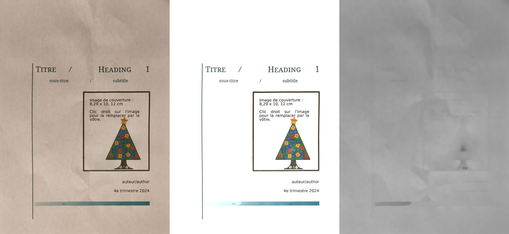
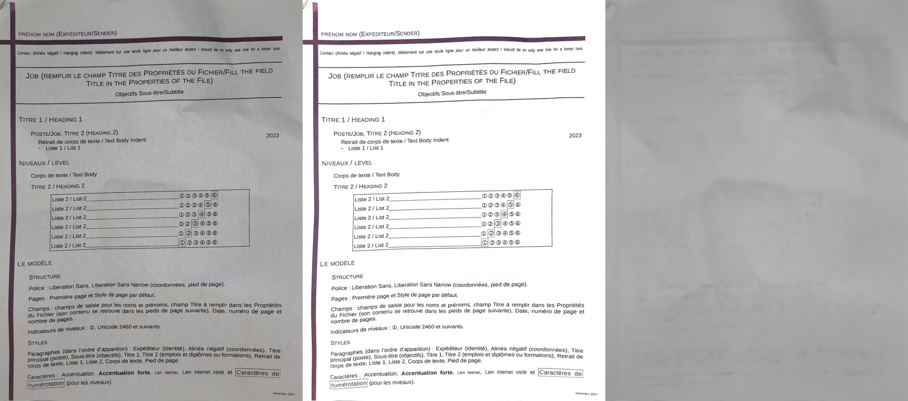
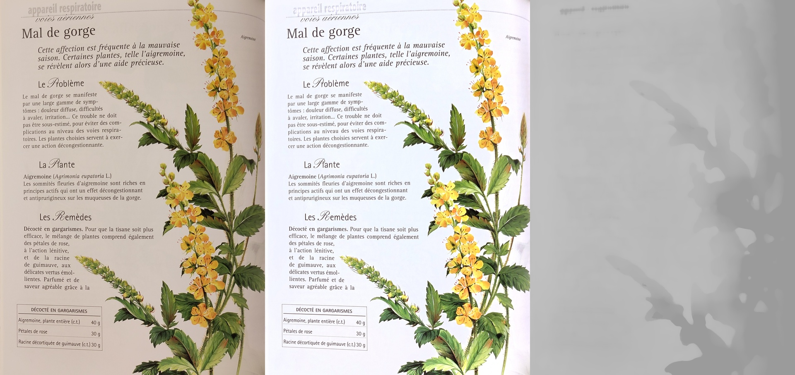

# Prototype photo document scanner image processing

This is an algorithm that can be used to make photographs of documents appear more "scan like", like having a white paper background and few/no shadows.
The sample images below show the original image, the result, and the "shadow layer" that was computed to correct brightness locally.

## High level algorithm

First, we use a gray world white balance to ensure that the paper is some shade of gray.

Then, the main idea is to create a layer without the text, keeping only the shadows and light variations on the paper.
Several tricks can be used to try to achieve this:
- **Max of all channels**: because the way paper and ink works is by subtracting color, colored parts in the document will have lower values in some channels.
The channel with the highest value is the one closest to the underlying paper's lightness.
- **Exclude highly saturated areas**: When colors are very saturated they can still bring down the lightness too much.
In these cases, it can help to discard those pixel's lightness.
It is then replaced by a blur of the neighboring pixels instead.
- **Thresholding**: Most documents involve dark text on a white background, where shadows have a value in between.
Using thresholding we can clamp dark areas which are likely to be ink and avoid bightening them too much.
- **Median blur**: In parts of the image with text or fine lines, a median blur is very effective at suppressing these.
It is also able to keep steep lightness changes (created by folds for example) and gradients (vignetting), which we do want to keep to later correct them.

Finally, we use the "shadow layer" as the ground truth to proportionnally increase the brightness of the image.
We can increase by a few percent, for example 5%, to get a mostly white background on our text.
